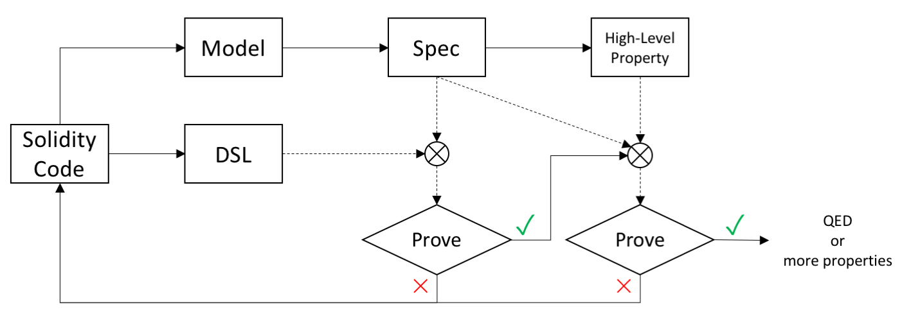

# Token Libraries with Proofs

This repository collects correctness proofs of Ethereum token contracts *wrt.* given specifications and high-level properties. All of them are accomplished in Coq. Currently, an ERC20 token contract and its proof are included, but more will be added in the future.

## Requirements

[Coq](https://coq.inria.fr/) is required if you are going to check the correctness of proofs in this repo. [ProofGeneral](https://proofgeneral.github.io/) or CoqIde is required if you are going to read the definitions and the proofs in this repo thoroughly.

### Coq 8.8.0

[Coq](https://coq.inria.fr/) is an interactive proof assistant, which, as its name suggested, assists users to construct proofs. Its also provides a small proof checker that checks the correctness of the proof. It is required if you desire to check the correctness of proofs in this repo.

The definitions and the proofs are implemented in Coq **8.8.0** (other versions may or may not work), which can be installed by following the [official instructions](https://github.com/coq/coq/wiki#coq-installation).

### CoqIde

CoqIde is the official graphic front-end of Coq. It's usually installed along with Coq as shown in the above [Coq installation instructions](https://github.com/coq/coq/wiki#coq-installation). It does not require further configurations after installation. If any, you can refer to the [official instructions](https://github.com/coq/coq/wiki/Configuration%20of%20CoqIDE).

### ProofGeneral

If you are an [Emacs](https://www.gnu.org/software/emacs/) user, a more convenient front-end of Coq is [ProofGeneral](https://proofgeneral.github.io/). The installation instructions of ProofGeneral can be found at https://proofgeneral.github.io/ and https://github.com/ProofGeneral/PG/blob/master/INSTALL.

## Repo Structure

* [`config.mk`](config.mk) defines the commands that are used to build/check the proofs in this repo.
* [`erc20/`](erc20) contains contract-specific definitions and proofs for an ERC20 token contract. The further proofs of other contracts will go to separate directories.
  * [`erc20.sol`](erc20/erc20.sol) is the proved ERC20 contract in Solidity.
  * [`_CoqProject`](erc20/_CoqProject) is a recommended way to manage a Coq project. It lists files in the project and is used to generate a makefile to build  them.
  * [`Model.v`](erc20/Model.v) models storage variables, events, message calls and the runtime environment of the contract.
  * [`Spec.v`](erc20/Spec.v) formally defines the specification of the ERC20 contract.
  * [`DSL.v`](erc20/DSL.v) represents the Solidity implementation of the ERC20 contract in a domain specific language, and  proves the implementation agrees with the specification in [`Spec.v`](erc20/Spec.v).
  * [`Prop.v`](erc20/Prop.v) defines several high-level properties of the ERC20 contract, and proves they are guaranteed by the contract implementation.
* [`libs/`](libs) contains contract-independent definitions, tactics and lemmas.
  * [`BNat.v`](libs/BNat.v) provides convenient tactics, lemmas and theorems to prove goals about boolean and integers.
  * [`TMap.v`](libs/TMap.v) and [`TMapLib.v`](libs/TMapLib.v) define a total map and provide convenient tactics and lemmas to prove goals related to total maps.
  * [`Mapping.v`](libs/Mapping.v) defines a structure based on the above total map to represent the Solidity ```mapping`` type in Coq. Several relevant tactics and lemmas are provided as well.
  * [`Types.v`](libs/Types.v) defines some other types of Solidity in Coq.
  * [`AbsModel.v`](libs/AbsModel.v) abstracts the contract model definitions. [`Model.v`](erc20/Model.v) defines the model for the ERC20 contract by instantiating this abstract model.
  * [`LibEx.v`](libs/LibEx.v) contains all miscellaneous stuffs.

## Quick Check Proofs

Coq proof checker can be invoked to check whether proofs are correct by the following command,

```shell
make
```

or if you want to check the proof of an individual contract,

```shell
cd erc20; make
```

## Proving Process

Given a contract in Solidity, the proving process can be divided into following steps and may involve the change of the contract as shown in the following diagram. We take an [ERC20 contract](erc20/erc20.sol) and its proof in [`erc20/`](erc20) as an example to explain the process.



### Define the Contract Model

The contract model abstracts the storage, the events, the message calls, and the external environment. The specification, high-level properties and proofs are all based on the contract model.

The model of different contracts can be defined in a similar form, so we separate the common definitions into the contract-independent part or the *abstract model* in [`AbsModel.v`](libs/AbsModel.v) and the contract-specific part or the *concrete model* in [`Model.v`](erc20/Model.v) under each contract directory. When proving a contract, we only need to generate the concrete model from the reused abstract model.

For example, the state of every contract can be composed of a contract address and values of storage variables, while the latter component is contract-specific. Thus, the contract state in the abstract model can be defined as below in [`AbsModel.v`](libs/AbsModel.v) :

```ocaml
(* Abstract type of the contract *)
Record TContract(TState: Type): Type :=
  mk_contract {
      w_a: address; (* contract address *)
      w_st: TState; (* contract storage state *)
    }.
```

which requires a state ```TState``` of concrete storage variables to instantiate.

Correspondingly, the concrete contract state of a ERC20 can be defined from the abstract one as below in [`Model.v`](erc20/Model.v):

```ocaml
(* State of storage variables in ERC20 contract. *)
Record state: Type :=
  mk_st {
      st_symbol     : string;  (* symbol      *)
      st_name       : string;  (* name        *)
      st_decimals   : uint8;   (* decimals    *)
      st_totalSupply: uint256; (* totalSupply *)

      st_balances: a2v;        (* balances    *)
      st_allowed: aa2v;        (* allowed     *)
   }.

(* ERC20 contract state instantiated from TContract with state. *)
Definition contract := TContract state.
```

### Represent the Solidity Implementation in Coq

In order to prove a contract, we need to first represent it in Coq. Instead of supporting every syntax structure of Solidity, we choose to design a domain specific language in Coq whose syntax is simple but enough to express most Solidity contracts. [`DSL.v`](erc20/DSL.v) includes a definition of such domain specific language. By carefully manipulating notations in Coq, DSL can event present a close look as Solidity. For example, ```transfer()``` in DSL is defined as below in [`DSL.v`](erc20/DSL.v):

```ocaml
  (* DSL representation of transfer(), generated from solidity *)
  Definition transfer_dsl : Stmt :=
    ((@require(balances[msg.sender] >= value)) ;
     (@require((msg.sender == to) || (balances[to] <= max_uint256 - value))) ;
     (@balances[msg.sender] -= value) ;
     (@balances[to] += value) ;
     (@emit Transfer(msg.sender, to, value)) ;
     (@return true)
    ).
```

Besides the syntax, it also needs to define the semantics of DSL as close to Solidity as possible. Because DSL is now generated per-contract, its semantics only needs to model a small portion of Solidity, such as  ```dsl_exec``` and ```dsl_exec_prim``` in [`DSL.v`](erc20/DSL.v).

Both the generation of DSL definition and the conversion from Solidity to DSL can be automated.

### Define the Contract Specification

The specification in this repo defines the expected behavior of each contract function. The specification is defined in a form like Hoare tuple  composed of two parts:

* **Invariant** defines conditions that must hold before and after every execution of every contract function. For simple contracts like ERC20 token contract. it can be as easy as True.

* **Function specifications** define the function-specific behavior of individual functions, each of which is further compose of the following components.

  * **Requirements** define the conditions besides the invariant that must hold before the execution of the specified function. It can be used to capture semantics of ```require``` statements in the specified function.
  * **Rules** define expected behavior of the specified function in each case. For different combinations of arguments, a contract function can behave differently, which may be too complicated to be described all together monolithically.  In such cases, we can separate them into exclusive and simple rules.  Two categories of behaviors are  described by a rule.
    * *State changes before and after the execution of a function*, such as how storage variables are changed.
    * *Logged events*.

  For example, the specification rule of ERC20 ```transfer()``` is defined as below in [`Spec.v`](erc20/Spec.v):

  ```ocaml
  Definition funcspec_transfer
             (to: address)
             (value: value) :=
    fun (this: address) (env: env) (msg: message) =>
      (mk_spec
         (* require(balances[msg.sender] >= _value); *)
         (fun S : state =>
            (st_balances S (m_sender msg )) >= value /\
         (* require(msg.sender == _to || balances[_to] <= MAX_UINT256 - _value); *)
            ((m_sender msg = to) \/ (m_sender msg <> to /\ st_balances S to <= MAX_UINT256 - value)))
  
         (* emit Transfer(msg.sender, _to, _value); *)
         (* return True; *)
         (fun S E => E = (ev_Transfer (m_sender msg) (m_sender msg) to value) :: (ev_return _ True) :: nil)
  
         (* State transition: *)
         (fun S S' : state =>
         (* totalSupply, name, decimals, symbol, allowed are not changed. *)
            st_totalSupply S' = st_totalSupply S /\
            st_name S' = st_name S /\
            st_decimals S' = st_decimals S /\
            st_symbol S' = st_symbol S /\
            st_allowed S' = st_allowed S /\
         (* balances[msg.sender] -= _value; *)
            st_balances S' = (st_balances S) $+{ (m_sender msg) <- -= value }
         (* balances[_to] += _value; *)
                                             $+{ to <- += value })
  
      ).
  ```

### Prove Against the Specification

Proofs in this step is to show each contract function in DSL does implement the corresponding specification. For example, we prove the following lemma in [`DSL.v`](erc20/DSL.v) to verify ```transfer()``` function.

```ocaml
  Lemma transfer_dsl_sat_spec:
    forall st env msg this,
      spec_require (funcspec_transfer _to _value this env msg) st ->
      forall st0 result,
        dsl_exec transfer_dsl st0 st env msg this nil = result ->
        spec_trans (funcspec_transfer _to _value this env msg) st (ret_st result) /\
        spec_events (funcspec_transfer _to _value this env msg) (ret_st result) (ret_evts result).
```

The proving is accomplished by constructing the starting state, the ending states and the logged events from definitions of ```dsl_exec``` and ```transfer_dsl```, and then checking whether those states and events can satisfy the conditions required by the specification ```spec_trans``` and ```spec_events```.

If the proving cannot be accomplished, it may imply bugs in the Solidity implementation. By analyzing the location where the proving gets stuck and the reason, we can get what modifications are required. After the necessary update, we can restart from the first step.

### Define the High-level Properties

The high-level properties define the expected behavior when all functions in a contract work as a whole. For example, the total supply in a ERC20 contract should always be the same as the sum of all balances, which can be defined as below in [`Prop.v`](erc20/Prop.v):

```ocaml
Theorem Property_totalSupply_equal_to_sum_balances :
  forall env0 env msg ml C E C' E',
    create env0 msg C E
    -> env_step env0 env
    -> run env C ml C' E'
    -> Sum (st_balances (w_st C')) (st_totalSupply (w_st C')).
```

### Prove Against the High-Level Properties

The proving of high-level properties is accomplished upon specifications. Because it has been proved that each contract function does implement its specifications, we can imply that the contract as a whole satisfies the high level properties. The proofs of above properties and other high-level ERC20 contract properties can be found in [`Prop.v`](erc20/Prop.v).

If the proving cannot be accomplished, it may imply bugs in the Solidity implementation. By analyzing the location where the proving gets stuck and the reason, we can get what modifications are required. After the necessary update, we can restart from the first step.

## How to Contribute

The correctness of proofs in this repo still relies on the correctness of all definitions, the conversion from Solidity to DSL, and Coq, which can not be verified in the same logical system. If you find any errors and/or have any suggestions, you are very appreciated to open issues and/or send us pull requests.

## Related Work

* KEVM: Semantics of EVM in K. https://github.com/kframework/evm-semantics
* DSLs for Ethereum Contracts. https://www.michaelburge.us/2018/05/15/ethereum-chess-engine.html
* Formal Verification of Ethereum Contracts (Yoichi's attempts). https://github.com/pirapira/ethereum-formal-verification-overview

## Acknowledgement

We would like to thank Yi Tang ([ConsenSys](https://consensys.net/)), Yuhui Wu ([轻信科技](http://www.ledgergo.com/)), and Zhong Zhuang ([DEx.top](https://dex.top/)) for their suggestions and help.

## Disclaimers

This repository is to demonstrate how the real world smart contracts can be formally proved in Coq, rather than providing smart contracts that can be used in arbitrary usage scenarios. 

1. The correctness of every proved contracts in this repo is defined against the given specifications and high-level properties, which may or may not fit a specific usage scenarios. 
2. The proof is only valid for the given contract implementation. Any changes in the contract implementation may invalidate the proof.
3. The reliability and the correctness of proved contracts depend on the correctness of all definitions in this repo, the conversion from Solidity to DSL, and Coq, which cannot be verified in the same logical system where proofs are checked. Any errors in those components would invalidate the contract correctness.

In addition, as licensed as LGPL v3, all artifacts in this repository are distributed in the hope it will be useful, but without any warranty, without even the implied warranty of merchantability or fitness for a particular purpose.
